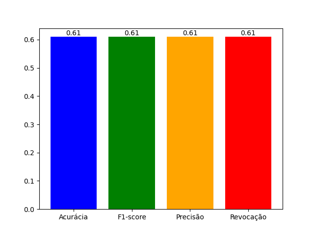
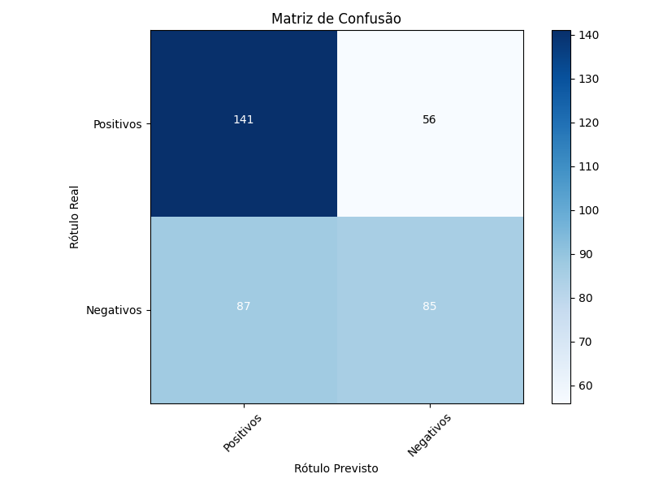
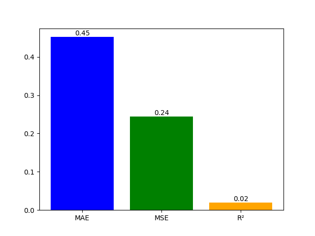

# Classificação de Espécies de Palmas no Sudoeste Baiano Através da Análise de Folhas

# Treino do Modelo e Avaliação de Desempenho - Documentação

## Resumo

Este script em Python implementa uma aplicação GTK para treinamento de um modelo de classificação usando o algoritmo RandomForest do scikit-learn. O modelo é treinado com dados carregados a partir de arquivos de texto (.txt) selecionados pelo usuário. Após o treinamento, o script exibe métricas de desempenho, como acurácia, F1-score, precisão e revocação, além de gerar um gráfico de barras para visualização rápida dessas métricas. Uma matriz de confusão também é gerada e exibida na interface gráfica.

## Dependências

- **numpy:** Biblioteca para manipulação eficiente de arrays.
- **scikit-learn:** Biblioteca para aprendizado de máquina.
- **matplotlib:** Biblioteca para criação de gráficos.
- **joblib:** Biblioteca para salvar e carregar modelos treinados.
- **Gtk:** Módulo para criar interfaces gráficas com o toolkit GTK.

Certifique-se de ter essas bibliotecas instaladas antes de executar o script.

## Descrição do Script

### Importação de Bibliotecas

```python
import numpy as np
from sklearn.ensemble import RandomForestClassifier
from sklearn.model_selection import train_test_split
from sklearn.metrics import accuracy_score, f1_score, precision_score, recall_score, confusion_matrix
import itertools
import matplotlib.pyplot as plt
import joblib
from matplotlib.backends.backend_gtk3agg import FigureCanvasGTK3Agg as FigureCanvas
import matplotlib
```

Este bloco importa as bibliotecas necessárias para o treinamento do modelo, avaliação de desempenho e criação da interface gráfica GTK.

### Função `plot_confusion_matrix`

```python
def plot_confusion_matrix(y_true, y_pred, class_names):
    # Implementação para plotar a matriz de confusão
    # ...
```

Esta função gera e salva uma matriz de confusão com base nos rótulos verdadeiros (`y_true`) e rótulos previstos (`y_pred`). A matriz é salva como uma imagem.

### Classe `ImageProcessorApp`

```python
class ImageProcessorApp(Gtk.Window):
    # Implementação da aplicação GTK para treinamento do modelo e exibição de métricas
    # ...
```

Esta classe representa a aplicação GTK. Ela inclui métodos para inicializar a interface, selecionar arquivos de texto, treinar o modelo, exibir métricas e plotar a matriz de confusão.

### Método `init_ui`

```python
def init_ui(self):
    # Inicializa a interface gráfica GTK
    # ...
```

Este método inicializa os elementos da interface gráfica, como botões, rótulos e barras de progresso.

### Método `select_txt_files`

```python
def select_txt_files(self, widget):
    # Abre um diálogo para selecionar arquivos de texto (.txt)
    # ...
```

Este método abre um diálogo para permitir que o usuário selecione arquivos de texto (.txt).

### Método `train_model`

```python
def train_model(self, widget):
    # Treina o modelo, avalia o desempenho e exibe métricas na interface gráfica
    # ...
```

Este método carrega os dados dos arquivos de texto selecionados, treina o modelo, calcula métricas de desempenho e exibe as métricas na interface gráfica.

## Execução do Script

```python
if __name__ == "__main__":
    app = ImageProcessorApp()
    app.connect("destroy", Gtk.main_quit)
    app.show_all()
    Gtk.main()
```

Este bloco de código cria uma instância da classe `ImageProcessorApp` e inicia a aplicação GTK quando o script é executado.

Certifique-se de ter as bibliotecas e dependências instaladas antes de executar o script.

# Processador de Imagens - Documentação

## Resumo

Este script em Python implementa uma aplicação GTK para processamento de imagens. Ele permite que o usuário selecione imagens, escolha um diretório de saída e processe as imagens selecionadas. Durante o processamento, a aplicação aplica diversas operações, como redimensionamento, conversão de cor, remoção de ruído, equalização de histograma, segmentação e outras técnicas de pré-processamento. A aplicação utiliza threads para processar as imagens de forma assíncrona, mantendo a interface gráfica responsiva.

## Dependências

- **OpenCV (cv2):** Biblioteca para visão computacional.
- **gi (GObject Introspection):** Módulo para integração do GTK com Python.
- **numpy:** Biblioteca para manipulação eficiente de arrays.
- **threading:** Módulo para suporte a programação concorrente.
- **concurrent.futures:** Módulo para execução concorrente usando threads.

Certifique-se de ter essas bibliotecas instaladas antes de executar o script.

## Descrição do Script

### Importação de Bibliotecas

```python
import os
import cv2
import gi
import numpy as np
import threading
from concurrent.futures import ThreadPoolExecutor
from gi.repository import Gtk, GLib
```

Este bloco importa as bibliotecas necessárias para a aplicação GTK, processamento de imagens e execução concorrente.

### Classe `ImageProcessorApp`

```python
class ImageProcessorApp(Gtk.Window):
    # Implementação da aplicação GTK para processamento de imagens
    # ...
```

Esta classe representa a aplicação GTK para processamento de imagens. Ela inclui métodos para inicializar a interface, selecionar imagens, escolher um diretório de saída, processar imagens e realizar operações de pré-processamento.

### Método `init_ui`

```python
def init_ui(self):
    # Inicializa a interface gráfica GTK
    # ...
```

Este método inicializa os elementos da interface gráfica, como botões, rótulos e barras de progresso.

### Métodos de Seleção

```python
def select_images(self, widget):
    # Abre um diálogo para selecionar imagens
    # ...

def select_output_dir(self, widget):
    # Abre um diálogo para selecionar um diretório de saída
    # ...
```

Esses métodos abrem diálogos para permitir que o usuário selecione imagens e um diretório de saída.

### Métodos de Processamento

```python
def process_image(self, image_path):
    # Processa uma única imagem
    # ...

def process_images(self, widget):
    # Inicia a thread para processar as imagens selecionadas
    # ...
```

Esses métodos processam as imagens selecionadas. `process_images` cria uma thread para realizar o processamento de forma assíncrona.

### Métodos de Pré-Processamento

```python
# Métodos para aplicar diferentes operações de pré-processamento nas imagens
def apply_color_conversion(self, img):
    # ...

def apply_noise_removal(self, img):
    # ...

def apply_contrast_adjustment(self, img):
    # ...

def apply_histogram_equalization(self, img):
    # ...

def refine_contours(self, image):
    # ...

def fill_holes(self, image):
    # ...

def apply_edge_filtering(self, img):
    # ...

def apply_intensity_normalization(self, img):
    # ...

def apply_segmentation(self, img):
    # ...

def color_segmentation(self, img):
    # ...

def enhance_green_color(self, img):
    # ...

def add_border_around_leaves(self, img):
    # ...

def get_pixel(self, event, x, y, flags, param, img):
    # ...

def remove_artifacts(self, img):
    # ...
```

Esses métodos representam diversas operações de pré-processamento que podem ser aplicadas nas imagens durante o processamento.

## Execução do Script

```python
win = ImageProcessorApp()
win.connect("destroy", Gtk.main_quit)
win.show_all()
Gtk.main()
```

Este bloco de código cria uma instância da classe `ImageProcessorApp` e inicia a aplicação GTK quando o script é executado.

Certifique-se de ter as bibliotecas e dependências instaladas antes de executar o script.

# Treinamento de Modelo - Documentação

## Resumo

Este script Python utiliza a biblioteca scikit-learn para treinar um modelo de regressão usando o algoritmo RandomForest. O modelo é treinado com dados provenientes de arquivos de texto (.txt). A aplicação GTK permite ao usuário selecionar esses arquivos, treinar o modelo e exibir métricas de avaliação, como o Erro Absoluto Médio (MAE), o Erro Quadrático Médio (MSE) e o Coeficiente de Determinação (R²). Além disso, um gráfico das métricas é gerado e exibido na interface gráfica.

## Dependências

- **NumPy:** Biblioteca para manipulação eficiente de arrays.
- **scikit-learn:** Biblioteca para aprendizado de máquina, incluindo o RandomForestRegressor.
- **matplotlib:** Biblioteca para criação de gráficos.
- **gi (GObject Introspection):** Módulo para integração do GTK com Python.

Certifique-se de ter essas bibliotecas instaladas antes de executar o script.

## Descrição do Script

### Importação de Bibliotecas

```python
import numpy as np
from sklearn.ensemble import RandomForestRegressor
from sklearn.model_selection import train_test_split
from sklearn.metrics import mean_absolute_error, mean_squared_error, r2_score
import matplotlib.pyplot as plt
from matplotlib.backends.backend_gtk3agg import FigureCanvasGTK3Agg as FigureCanvas
import matplotlib
matplotlib.use('Agg')
import gi
gi.require_version("Gtk", "3.0")
from gi.repository import Gtk, GLib
```

Este bloco importa as bibliotecas necessárias para treinamento do modelo, manipulação de dados e criação de gráficos.

### Classe `ImageProcessorApp`

```python
class ImageProcessorApp(Gtk.Window):
    # Implementação da aplicação GTK para treinamento do modelo e exibição de métricas
    # ...
```

Esta classe representa a aplicação GTK para treinamento do modelo de regressão e exibição de métricas. Ela inclui métodos para inicializar a interface, selecionar arquivos .txt, treinar o modelo, calcular métricas e exibir resultados.

### Método `init_ui`

```python
def init_ui(self):
    # Inicializa a interface gráfica GTK
    # ...
```

Este método inicializa os elementos da interface gráfica, como botões, rótulos, barras de progresso e labels de métricas.

### Métodos de Seleção

```python
def select_txt_files(self, widget):
    # Abre um diálogo para selecionar arquivos .txt
    # ...
```

Este método abre um diálogo para permitir que o usuário selecione arquivos .txt contendo dados para treinamento do modelo.

### Método `train_model`

```python
def train_model(self, widget):
    # Treina o modelo e exibe métricas
    # ...
```

Este método realiza o treinamento do modelo de regressão usando dados dos arquivos .txt selecionados. Ele exibe métricas como MAE, MSE e R² na interface gráfica. Além disso, gera e exibe um gráfico das métricas.

## Execução do Script

```python
if __name__ == "__main__":
    app = ImageProcessorApp()
    app.connect("destroy", Gtk.main_quit)
    app.show_all()
    Gtk.main()
```

Este bloco de código cria uma instância da classe `ImageProcessorApp` e inicia a aplicação GTK quando o script é executado.

Certifique-se de ter as bibliotecas e dependências instaladas antes de executar o script.

## Resultados finais do Trabalho

Grafícos de Acuracia, F1-socore, Revocação e Precisão



Matriz de Confusão



Grafíco de Regressão


